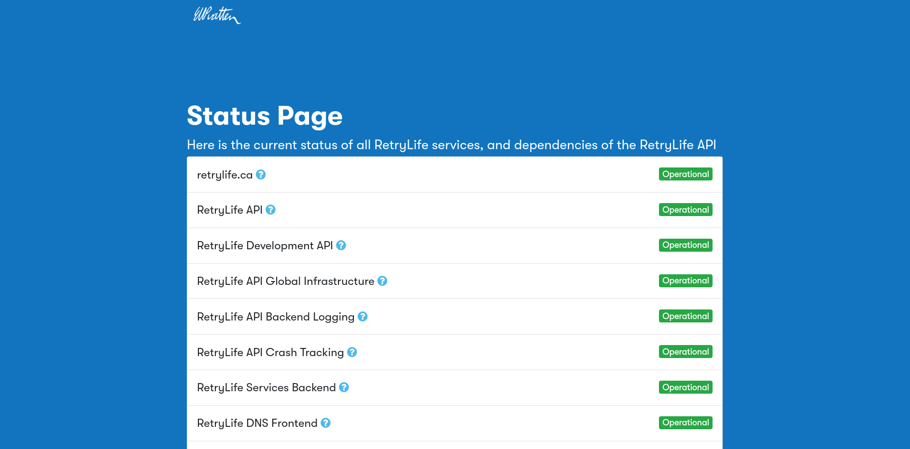

# RetryLife Web Status Page
A simple status-tracking webpage for all RetryLife services

## What does this do?
[status.retrylife.ca](https://status.retrylife.ca) is a Jekyll-based webapp for cleanly displaying the status of all RetryLife services, and some other important backend info. This webapp is used to help debug issues people may encounter while using my services. The page is powered by the `/status` endpoint of my API, and data is cached over a 30-second period. This webapp will automatically poll for new status data in the background.

## Forking this repo

Pretty all the logic can be found in `assets/js/status.js`. If you would like to fork this project for use with your own services, just change that file, and feel free to modify the branding in `_config.yml` and `_includes/nav.html`.

## Screenshots

*Status page in action*